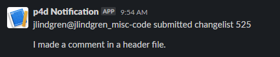
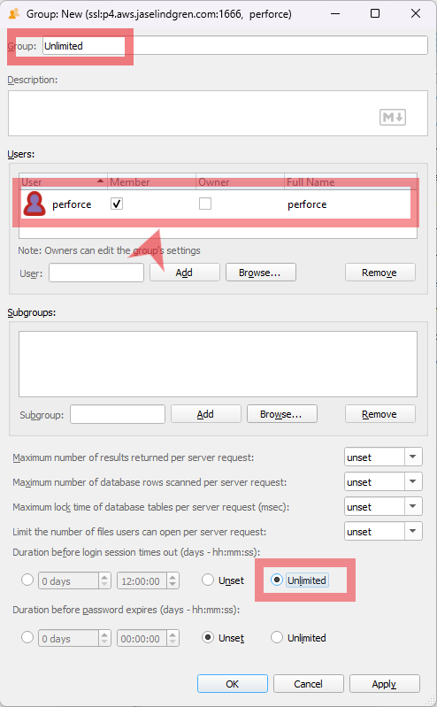

# Perforce Send Webhooks
These are scripts that post a message to Discord or Slack every time a new changelist is submitted to the Perforce Helix Core server.
This was forked from [Saadbruno's Perforce Discord Webhook](https://github.com/saadbruno/perforce-discord-webhook) to add a slack option as well.

### Discord  


### Slack  


## Requirements:
1. This was only tested with p4d running on a linux system with bash (Ubuntu 20.04, Rocky, CentOS, etc.)
2. The Perforce user needs access read access to the depot, so it can access the `p4 describe` command (more info below)
3. You need a [Discord Webhook](https://support.discordapp.com/hc/en-us/articles/228383668-Intro-to-Webhooks) or [Slack Webhook](https://api.slack.com/messaging/webhooks) set up
4. You need access to edit the `p4 triggers` on the server

## Installation:
### 1. Setting up p4 access on the command line
Perforce triggers run as the same linux user as the Perforce server is running. It's usually the `perforce` user, but you can double check by running `ps aux | grep p4d`

So for the script to work, the `perforce` user needs to be able to run `p4 describe` successfully. To do that, the steps are as following:
1. Log in as the `perforce` user on the terminal by running `sudo su perforce` (followed by `bash` if needed).
2. Set your Perforce login by running
```
p4 set P4PORT=ssl:localhost:1666
p4 set P4USER=your.username
p4 trust
p4 login
```
Followed by your password.

- It's easier if the user set up in this step has no session timeout, so you don't have to log in over and over. You can change that in the p4 admin app. (See suggestion below)
- If your server doesn't support SSL, make sure to remove `ssl:` from the `P4PORT`. Ex.: `p4 set P4PORT=localhost:1666`

#### Note on p4dctl
If you're using p4dctl to manage your servers, the user set in the p4dctl config must be the same as set on item 1.2 (in the `p4 set P4USER=your.username` command)

To check that, either check the `/etc/perforce/p4dctl.conf` file or the `/etc/perforce/p4dctl.conf.d/` directory containing your server configuration file. More info [here](https://www.perforce.com/perforce/r16.1/manuals/p4sag/appendix.p4dctl.html).

### 2. Setting up the script
That's the easy part.
1. Clone the repo, or download the relevant `.sh` script directly and save it somewhere where the perforce user (or whatever user your server is running) has access to.
2. Make sure the script is executable by running `chmod u+x p4_discord_webhook.sh` or `chmod u+x p4_slack_webhook.sh` (depending on which script you are using)

At this point, you should already be able to run the script manually with `./p4_discord_webhook.sh <changelist number> <discord webhook link>` or `./p4_slack_webhook.sh <changelist number> <discord webhook link>`

### 3. Setting up the trigger
Perforce has a Triggers system, where you can configure the server to do actions based on triggers. Here we will create a trigger that calls this script every time a changelist is submitted to any depot.

1. In the terminal run `p4 triggers`. This will open the server triggers editor.
2. Add a new trigger with these settings (select either the Discord or Slack version):
```
Triggers:
	discord change-commit //... "/bin/bash <p4_discord_webhook.sh location> %changelist% <discord webhook link>
```
```
Triggers:
	slack change-commit //... "/bin/bash <p4_slack_webhook.sh location> %changelist% <discord webhook link>
```
And replace the location and the webhook links according to your setup. Example:
```
	discord change-commit //depot/... "/bin/bash /home/perforce/perforce_discord_webhook.sh %changelist% https://discordapp.com/api/webhooks/<id>/<auth>"
```
You can also customize this to trigger only on specific directories by changing the `//...` bit to just be a specific depot or even a branch or stream within that depot. For example, `//My_Project/...` will only trigger on submits to the My_Project depot.
You can add multiple lines to your p4 trigger configuration, too. So you could have submits to different depots or streams go to different webhooks (for different project channels on Slack/Discord, for example).

**Note:** It is really important to keep the tab before the trigger line, otherwise the server will not recognize it.

[p4 triggers documentation](https://www.perforce.com/manuals/v18.1/cmdref/index.html#CmdRef/p4_triggers.html)  
You can also run `p4 help triggers` for more info

***

At this point, everything should be working as intended! Submit a new changelist and check it out!

*** 

### Suggestion: user management
In item 1.2 it was mentioned that it's easier if the user running the `p4 describe` command doesn't have a timeout so you don't need to reauthenticate from time to time.

To change a user's password timeout, add them to a group with unlimited password timeout.
1. On the P4Admin app, create a new group called "Unlimited" (or whatever you want)
2. Assign your perforce user (or whichever user is set on your server) to the group by typing their name in the `User:` field and clicking Add (or you can Browse... to find the username)
3. Then change the `Duration before login session times out` to **Unlimited**
4. Click OK. Now when you login with that user, their session will never timeout. (Be careful with this since any users added to this group will only have to login on each machine once and they will stay logged in forever. Only allow this for users where you are ok with that.)


